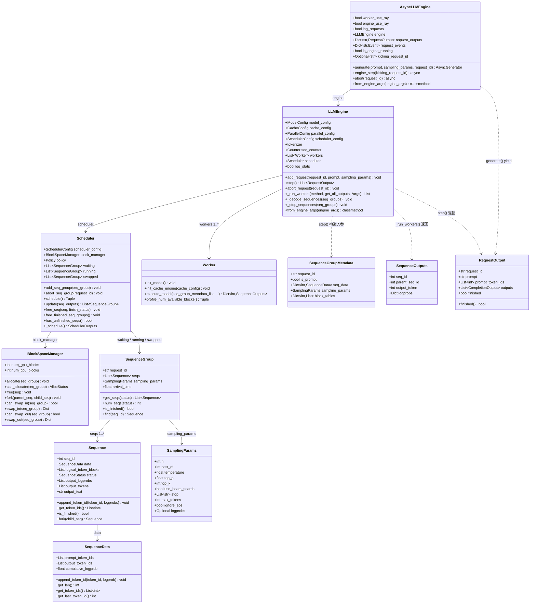

# AsyncLLMEngine.generate 调用链分析

基于 `vllm/engine/async_llm_engine.py`（早期版本，共 219 行）源码分析。

---

## 1. 函数调用流程

**入口：** `AsyncLLMEngine.generate`（L78）— async generator

```
AsyncLLMEngine.generate(prompt, sampling_params, request_id, prompt_token_ids)
│
├─ [初始化阶段, L104-127]
│   ├─ time.time()                           → arrival_time
│   ├─ asyncio.Event()                       → request_event（每个请求独立）
│   ├─ self.request_events[request_id] = request_event
│   └─ engine.add_request(...)               → LLMEngine.add_request()
│         ├─ tokenizer.encode(prompt)        → prompt_token_ids
│         ├─ new Sequence(seq_id, ...) × best_of 个
│         ├─ new SequenceGroup(request_id, seqs, sampling_params, arrival_time)
│         └─ scheduler.add_seq_group(seq_group)   → 加入 waiting 队列
│
└─ [主循环, L132-168]  while True:
    │
    ├─ [abort 检测] if request_id not in request_events → return
    │
    ├─ [驱动引擎] if not self.is_engine_running:
    │    └─ await engine_step(request_id)         → AsyncLLMEngine.engine_step() [L57]
    │          ├─ self.is_engine_running = True
    │          ├─ await asyncio.sleep(0)           （让其他协程先执行 add_request）
    │          ├─ self.engine.step()               → LLMEngine.step() [L210]
    │          │     ├─ scheduler.schedule()       → (SequenceGroupMetadata[], SchedulerOutputs)
    │          │     │     └─ _schedule()          （FCFS调度，处理抢占/swap/waiting→running）
    │          │     ├─ _run_workers("execute_model", seq_group_metadata_list, ...)
    │          │     │     └─ worker.execute_model() × N 个 GPU Worker（广播调用）
    │          │     │           → Dict[int, SequenceOutputs]
    │          │     ├─ scheduler.update(output)   → 追加新 token，处理 beam-search fork
    │          │     ├─ _decode_sequences(seqs)    → detokenize 新 token
    │          │     ├─ _stop_sequences(seqs)
    │          │     │     └─ scheduler.free_seq(seq, status)（释放 KV cache blocks）
    │          │     ├─ scheduler.free_finished_seq_groups()
    │          │     └─ return List[RequestOutput]
    │          ├─ self.is_engine_running = False
    │          └─ request_events[req_id].set()     （唤醒等待的 generate 协程）
    │
    ├─ [等待输出] await asyncio.wait_for(request_event.wait(), timeout=1s)
    │    └─ TimeoutError → continue（防死锁，TIMEOUT_TO_PREVENT_DEADLOCK = 1s）
    │
    ├─ request_event.clear()
    ├─ yield request_output                        （流式返回给调用方）
    │
    └─ [终止检测] if request_output.finished():
          ├─ del request_outputs[request_id]
          ├─ del request_events[request_id]
          ├─ await engine_step()                   （无 kicking_request_id，drain 剩余请求）
          └─ break
```

---

## 2. 类图



---

## 3. 关键文件索引

| 类 | 文件 | 起始行 |
|---|---|---|
| `AsyncLLMEngine` | `vllm/engine/async_llm_engine.py` | L17 |
| `AsyncLLMEngine.generate` | `vllm/engine/async_llm_engine.py` | L78 |
| `AsyncLLMEngine.engine_step` | `vllm/engine/async_llm_engine.py` | L57 |
| `LLMEngine` | `vllm/engine/llm_engine.py` | L20 |
| `LLMEngine.add_request` | `vllm/engine/llm_engine.py` | L149 |
| `LLMEngine.step` | `vllm/engine/llm_engine.py` | L210 |
| `Scheduler` | `vllm/core/scheduler.py` | L51 |
| `Scheduler.schedule` | `vllm/core/scheduler.py` | L259 |
| `SequenceGroup` / `Sequence` | `vllm/sequence.py` | L160 / L73 |
| `SamplingParams` | `vllm/sampling_params.py` | L5 |
| `Worker` | `vllm/worker/worker.py` | — |

---

## 4. 核心设计要点

| 机制 | 位置 | 作用 |
|---|---|---|
| `asyncio.Event`（每请求一个） | `self.request_events` | `engine_step()` 完成后 `set()`，唤醒对应 `generate()` 协程 |
| `asyncio.wait_for(..., timeout=1s)` | `generate()` L145 | 防止引擎卡死时协程永久阻塞 |
| `is_engine_running` 标志位 | `engine_step()` | 防止多个并发 `generate()` 协程同时调用 `engine.step()` |
| `asyncio.sleep(0)` | `engine_step()` L67 | 协作式让出事件循环，让其他协程先完成 `add_request()` |
| `kicking_request_id` | `engine_step()` + `abort()` | 标识当前驱动 step 的请求，`abort()` 据此安全重置运行标志 |
| `async generator` (`yield`) | `generate()` L154 | 每步推理后立即流式返回，无需等待全部完成 |

> **版本说明**：这是 vLLM 早期简化版本，无后台常驻循环，`generate()` 自驱引擎。新版本已演化为独立后台 task + `RequestTracker` + `AsyncStream` 架构。
