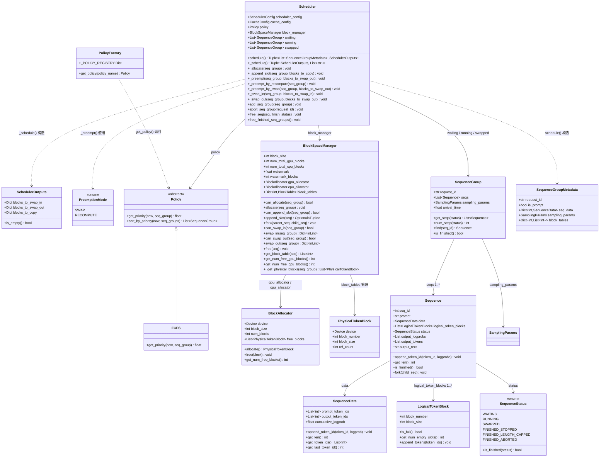

# Scheduler.schedule 调用链分析与类图

基于 `vllm/core/scheduler.py` 源码分析。

---

## 0. 前置知识

### 0.1 block_table：三层存储架构

vLLM 将每个序列的 KV cache 切成固定大小的块（`block_size` 个 token 一块），分三层管理：

**层 1 — 逻辑层：`LogicalTokenBlock`（`block.py:9`）**

序列视角的连续分块，存储实际 token_ids 内容。
- `block_number`：同一序列内严格连续（0, 1, 2, …），创建时赋值为 `len(self.logical_token_blocks)`
- 本质：把序列的 token_ids 顺序切分，每块装满 `block_size` 个 token 后再开下一块

**层 2 — 物理块元数据层：`PhysicalTokenBlock`（`block.py:49`）**

仅是元数据对象，不持有任何 tensor 数据，是逻辑块到实际显存的映射凭证。
- `block_number`：全局内存池中的编号（0…N-1），分配时从 `BlockAllocator.free_blocks` 池弹出，同一序列中往往不连续（如逻辑块 0→物理块 42，逻辑块 1→物理块 7）
- `ref_count`：当前有多少个序列的 block_table 指向此物理块（beam search 共享 prompt 块时 > 1）

**层 3 — 实际存储层：`CacheEngine.gpu_cache / cpu_cache`（Worker 内）**

预分配的大块 tensor，存储真正的 K/V 向量数据。
- 形状：`kv_cache[layer_id][0/1][block_number][head_id][head_dim]`（0=K，1=V）
- 数据类型：fp16 或 bf16（LLaMA/Mistral 等现代模型默认 bf16）
- 每个物理块占用显存：`block_size × num_layers × 2 × num_heads × head_dim × sizeof(dtype)`
- `PhysicalTokenBlock.block_number` 是桥梁：调度器通过 block_table 给出物理块号，GPU kernel 以此为下标寻址 kv_cache tensor 中的实际 K/V 数据

**三层关系图**

```
Sequence（序列）
│
├── logical_token_blocks: List[LogicalTokenBlock]    ← 层1：逻辑层
│       [0]  block_number=0, token_ids=[t0..t15]
│       [1]  block_number=1, token_ids=[t16..t31]
│       [2]  block_number=2, token_ids=[t32..t47]  ← is_full=False，末块
│
│   block_table = BlockSpaceManager.block_tables[seq_id]
│       (List[PhysicalTokenBlock]，下标 i = 逻辑块号)
│
├── block_table[0] → PhysicalTokenBlock(block_number=42, ref_count=1)  ← 层2：物理块元数据
├── block_table[1] → PhysicalTokenBlock(block_number=7,  ref_count=1)
└── block_table[2] → PhysicalTokenBlock(block_number=15, ref_count=1)
                              │
                              │  block_number 作为下标
                              ▼
CacheEngine.gpu_cache                                ← 层3：实际存储（GPU tensor）
  kv_cache[layer_id][0][42][head_id][head_dim]  ← block 42 的 K 向量（bf16）
  kv_cache[layer_id][1][42][head_id][head_dim]  ← block 42 的 V 向量（bf16）
  kv_cache[layer_id][0][ 7][head_id][head_dim]  ← block  7 的 K 向量
  ...
```

**block_table**（`BlockTable = List[PhysicalTokenBlock]`）：连接层1与层2的映射表
- 下标 i = 逻辑块号，值 = 对应物理块；`Sequence.logical_token_blocks[i].block_number == i`，`block_table[i]` 是对应物理块，两者下标严格对应，长度始终相等
- 调度器通过 `len(block_table) < len(logical_token_blocks)` 判断物理层是否跟上逻辑层（`append_slot` 据此决定是否需要新分配物理块）

> 本质与操作系统的**虚拟内存/页表**相同：逻辑地址连续（方便序列顺序访问），物理地址散落（充分利用碎片化显存），两者通过 block_table 映射，实际数据在 GPU tensor 中。

---

### 0.2 beam search 与多序列采样

**beam search 是什么**：生成时同时维护 `best_of` 条候选序列（beam），每步保留联合概率最高的若干条，最终取前 `n` 条返回。适用于翻译、摘要等需要高质量确定性输出的场景；对话、创意写作等更多用随机采样。

**关键参数**（`SamplingParams`）：

| 参数 | 含义 | 对计算的影响 |
|---|---|---|
| `best_of` | 内部维护的候选序列数（beam 宽度 / 独立采样数） | KV cache 占用 × `best_of`，prompt 物理块 `ref_count` 初始值 = `best_of` |
| `n` | 最终返回给用户的序列数（`n ≤ best_of`） | 仅影响输出裁剪，不影响计算量 |
| `use_beam_search` | 是否启用 beam search；`False` 时 `best_of` 条序列独立随机采样 | `best_of > 1` 时两种模式均共享 prompt 物理块；`best_of=1` 时单序列无共享 |

**为什么共享 prompt 物理块**：`_allocate` 时只取 `seqs[0]` 的 logical_token_blocks 分配物理块，令 `block.ref_count = seq_group.num_seqs()`，再将同一批物理块的浅拷贝分发给每条序列。`best_of=1` 时无共享（`ref_count=1`）。

**如何从 `best_of` 中选出 `n` 条**（`outputs.py:75`）：
```python
sorted_seqs = sorted(seqs, key=lambda seq: seq.get_cumulative_logprob(), reverse=True)
top_n_seqs = sorted_seqs[:n]
```
按 `cumulative_logprob` 降序取前 `n` 条。`cumulative_logprob` 是联合概率的 log 值，通过逐步累加每个 token 的 log 概率得到：
- 真实联合概率是连乘：`P(x₁,…,xT) = P(x₁) × P(x₂|x₁) × … × P(xT|x₁…xT₋₁)`
- 模型每步输出 log 概率，代码将其逐步累加：`cumulative_logprob += logprob`
- 累加结果 = `Σ log P(xᵢ|…) = log P(x₁,…,xT)`，与联合概率等价（`log(a×b) = log(a)+log(b)`）
- 用 log 的原因：①**数值稳定**（浮点数指数位范围有限，概率连乘几十步后会下溢为 0，如每步概率 0.01，50 步后 `0.01^50=1e-100` 在 float32 中已下溢；log 空间变为负数相加，始终可表示）；②**单调递增**，排序结果与直接比概率一致

**beam search 与调度的关系**：
- `best_of > 1` 时各序列共享 prompt 物理块（`ref_count = best_of`），第一次 decode 的 `_schedule` 中，`_append_slot` 检测末块 `ref_count > 1`，触发 **CoW**（Copy-on-Write），各 beam 从共享末块克隆出私有块
- 被抢占时只能走 **SWAP**（GPU→CPU 保留 KV cache），不走 RECOMPUTE（多 beam 重新 prefill + fork 代价过高）

---

### 0.3 watermark：GPU 显存安全水位线

`BlockSpaceManager` 构造参数 `watermark`（默认 `0.01`，即 1%），用于防止显存被完全耗尽引发边界 OOM。

**计算方式**（`block_manager.py:72`）：
```python
self.watermark_blocks = int(watermark * num_gpu_blocks)  # 预留约 1% GPU 块
```

**作用**：`can_allocate` 和 `can_swap_in` 均要求空闲块数超过所需块数后还剩 `watermark_blocks` 个余量：
```python
# can_allocate（L87）：GPU空闲块 - 所需块数 ≥ watermark_blocks
return num_free_gpu_blocks - num_required_blocks >= self.watermark_blocks

# can_swap_in（L166）：GPU空闲块 - (占用块+新seq数) ≥ watermark_blocks
return num_free_blocks - num_required_blocks >= self.watermark_blocks
```

**为什么需要**：`can_append_slot` 只做粗粒度估算（空闲块数 ≥ running seq 数），不精确。若把显存全部分配出去，某个 step 中 `append_slot` 实际需要新块时可能已无块可用，触发 OOM。watermark 留出缓冲区，吸收这种边界竞争。

---

### 0.4 调度容量参数：max_num_seqs 与 max_num_batched_tokens

两个参数从不同维度限制调度容量，均来自 `SchedulerConfig`：

| 参数 | 限制什么 | 检查阶段 | 本质问题 |
|---|---|---|---|
| `max_num_seqs` | 并发 running 序列总数 | 阶段2（swap-in）、阶段3（waiting→running） | 显存上限 |
| `max_num_batched_tokens` | 单步 forward 的总 token 计算量 | 仅阶段3（新 prompt 调入） | 算力/单步延迟上限 |

**`max_num_seqs`**：每条 running 序列持续占用 GPU KV cache 块，序列越多显存压力越大。阶段2和阶段3均检查 `num_curr_seqs + num_new_seqs ≤ max_num_seqs`。

**`max_num_batched_tokens`**：模型每个 step 做一次 forward pass，batch 中所有 token 的计算量之和不能过大，否则单步延迟过高或 OOM。只在阶段3新 prompt 调入时检查，因为：
- decode 阶段：每条序列每步只新增 1 个 token，贡献极小
- prefill 阶段：新 prompt 可能有数千 token，一次性全量参与计算，代价远大于 decode

---

## 1. 函数调用流程

**入口：** `Scheduler.schedule()`（L259）— 返回 `(List[SequenceGroupMetadata], SchedulerOutputs)`

```
Scheduler.schedule()
│
├─ self._schedule()                             [L105] → (SchedulerOutputs, prompt_group_ids)
│   │
│   ├─ [阶段1: RUNNING → 保留/抢占（为下一 token 预留 slot）]
│   │   ├─ policy.sort_by_priority(now, self.running)
│   │   │     └─ FCFS.get_priority(now, seq_group) = now - seq_group.arrival_time
│   │   │         → 按等待时长降序排列（等待越久优先级越高，队首优先级最高）
│   │   │
│   │   └─ while self.running:  [逐个检查 running 中的 seq_group]
│   │         ├─ block_manager.can_append_slot(seq_group)  → GPU空闲块 ≥ running seq 数量?
│   │         │
│   │         ├─ [若不够] → 抢占
│   │         │   │   ※ running 已按 FCFS 降序排列，队尾即优先级最低的 seq_group
│   │         │   │   victim = self.running.pop(-1)   → 取队尾（最低优先级）
│   │         │   │   若 running 已空则抢占当前 seq_group 自身
│   │         │   └─ self._preempt(victim_seq_group, blocks_to_swap_out)   [L343]
│   │         │         │   ※ 单序列→RECOMPUTE，多序列（best_of>1）→SWAP（见前置知识 0.2）
│   │         │         ├─ [单序列 → RECOMPUTE] 直接释放 GPU 块，下次重新 prefill
│   │         │         │   └─ self._preempt_by_recompute(seq_group)       [L373]
│   │         │         │         ├─ seq.status = WAITING
│   │         │         │         ├─ block_manager.free(seq)               → 释放该 seq 的全部 GPU 物理块
│   │         │         │         │     └─ _free_block_table(block_table)  → 遍历 block_table 中每一块
│   │         │         │         │           └─ BlockAllocator.free(block) × N
│   │         │         │         │                 N = len(block_table)，即该 seq KV cache 占用的物理块总数
│   │         │         │         │                 → ref_count--，降为 0 则归还到 free_blocks 池
│   │         │         │         └─ self.waiting.insert(0, seq_group)     → 插回 waiting 队首（优先调度）
│   │         │         │
│   │         │         └─ [多序列 beam search → SWAP] 保留 KV cache 迁移到 CPU
│   │         │             └─ self._preempt_by_swap(seq_group, blocks_to_swap_out)  [L386]
│   │         │                   ├─ seq.status = SWAPPED
│   │         │                   ├─ self._swap_out(seq_group, blocks_to_swap_out)   [L407]
│   │         │                   │     ├─ block_manager.can_swap_out(seq_group)
│   │         │                   │     │     ├─ _get_physical_blocks()             → 获取该组唯一物理块集合
│   │         │                   │     │     └─ CPU空闲块 ≥ len(物理块集合) ?
│   │         │                   │     └─ block_manager.swap_out(seq_group)         → GPU块搬到CPU
│   │         │                   │           ├─ cpu_allocator.allocate() × N        → 分配 CPU 块
│   │         │                   │           ├─ gpu_allocator.free(gpu_block) × N   → 释放 GPU 块
│   │         │                   │           └─ return {gpu_block_num: cpu_block_num}
│   │         │                   └─ self.swapped.append(seq_group)        → 放入 swapped 等待 swap-in
│   │         │
│   │         └─ [若够] → 追加 slot
│   │             └─ self._append_slot(seq_group, blocks_to_copy)          [L329]
│   │                   └─ block_manager.append_slot(seq) 对每个 RUNNING seq  [L112]
│   │                         ├─ [情况1: len(block_table) < len(logical_token_blocks)]
│   │                         │   → token 刚填满上一块，逻辑层已建新块但物理层未跟上
│   │                         │   → gpu_allocator.allocate()               → 新建 GPU 物理块（append）
│   │                         │   → return None（无需 CoW）
│   │                         ├─ [情况2: 末块 ref_count == 1]
│   │                         │   → 末块未被其他序列共享，可直接写入
│   │                         │   → return None
│   │                         └─ [情况3: 末块 ref_count > 1（beam search 各序列共享 prompt 末块）]
│   │                               → Copy-on-Write:
│   │                               new_block = gpu_allocator.allocate()   → 分配新 GPU 块（当前 seq 私有）
│   │                               block_table[-1] = new_block            → 替换末块指针（不是 append，块数不变）
│   │                               gpu_allocator.free(last_block)         → 旧共享块 ref_count--
│   │                               return (src_block_num, dst_block_num)  → 记入 blocks_to_copy
│   │                               ※ 调度器只记录映射，实际数据拷贝由 GPU kernel 在执行前完成
│   │
│   ├─ [阶段2: SWAPPED → RUNNING（swap-in），仅在无 swap-out 时执行]
│   │   ├─ policy.sort_by_priority(now, self.swapped)
│   │   └─ while self.swapped and not blocks_to_swap_out:
│   │         ├─ block_manager.can_swap_in(seq_group)
│   │         │     └─ GPU空闲块 - (占用块 + 新seq数) ≥ watermark_blocks ?
│   │         ├─ [容量检查] num_curr_seqs + num_new_seqs ≤ max_num_seqs
│   │         └─ self._swap_in(seq_group, blocks_to_swap_in)               [L397]
│   │               ├─ block_manager.swap_in(seq_group)                    → CPU块→GPU块
│   │               │     ├─ gpu_allocator.allocate() × N
│   │               │     ├─ cpu_allocator.free(cpu_block) × N
│   │               │     └─ return {cpu_block_num: gpu_block_num}
│   │               ├─ seq.status = RUNNING
│   │               └─ self._append_slot(seq_group, blocks_to_copy)        → 同阶段1
│   │
│   ├─ [阶段3: WAITING → RUNNING（仅在 swapped 为空时）]
│   │   │   ※ swapped 严格优先于 waiting：swapped 序列的 KV cache 已占用 CPU 内存，若此时
│   │   │     新调入 waiting 序列会占用 GPU 块导致 swapped 无法 swap-in，CPU 内存无界堆积；
│   │   │     必须先清空 swapped（偿还 CPU 内存），再接纳新请求
│   │   └─ while self.waiting and not self.swapped:
│   │         ├─ block_manager.can_allocate(seq_group)
│   │         │     └─ GPU空闲块 - 所需块数 ≥ watermark_blocks ?
│   │         ├─ [token预算] num_batched_tokens + num_prompt_tokens ≤ max_num_batched_tokens
│   │         ├─ [容量检查] num_curr_seqs + num_new_seqs ≤ max_num_seqs
│   │         └─ self._allocate(seq_group)                                 [L324]
│   │               ├─ block_manager.allocate(seq_group)                   [L89]
│   │               │     ├─ 只取 seqs[0] 的 logical_token_blocks 分配物理块
│   │               │     ├─ gpu_allocator.allocate() × num_prompt_blocks
│   │               │     │     block.ref_count = seq_group.num_seqs()
│   │               │     │     ※ ref_count = best_of，所有序列共享这批 prompt 物理块
│   │               │     └─ block_tables[seq.seq_id] = block_table.copy() 对每个 seq
│   │               │           ※ 浅拷贝：各 seq 的 block_table 指向同一批 PhysicalTokenBlock
│   │               └─ seq.status = RUNNING
│   │
│   └─ [统计日志（可选，每 5s 输出一次）]
│         ├─ block_manager.get_num_free_gpu_blocks()
│         └─ block_manager.get_num_free_cpu_blocks()
│
└─ [组装输出: 遍历 self.running，构建 SequenceGroupMetadata]
      ├─ seq_group.get_seqs(status=RUNNING)
      ├─ block_manager.get_block_table(seq)  → [block_number, ...] 物理块号列表
      └─ new SequenceGroupMetadata(request_id, is_prompt, seq_data, sampling_params, block_tables)
```

---

## 2. 类图



---

## 3. 关键文件索引

| 类 / 方法 | 文件 | 行号 |
|---|---|---|
| `Scheduler` | `vllm/core/scheduler.py` | L51 |
| `Scheduler.schedule` | `vllm/core/scheduler.py` | L259 |
| `Scheduler._schedule` | `vllm/core/scheduler.py` | L105 |
| `Scheduler._allocate` | `vllm/core/scheduler.py` | L324 |
| `Scheduler._append_slot` | `vllm/core/scheduler.py` | L329 |
| `Scheduler._preempt` | `vllm/core/scheduler.py` | L343 |
| `Scheduler._preempt_by_recompute` | `vllm/core/scheduler.py` | L373 |
| `Scheduler._preempt_by_swap` | `vllm/core/scheduler.py` | L386 |
| `Scheduler._swap_in` | `vllm/core/scheduler.py` | L397 |
| `Scheduler._swap_out` | `vllm/core/scheduler.py` | L407 |
| `SchedulerOutputs` | `vllm/core/scheduler.py` | L31 |
| `PreemptionMode` | `vllm/core/scheduler.py` | L18 |
| `BlockSpaceManager` | `vllm/core/block_manager.py` | L56 |
| `BlockAllocator` | `vllm/core/block_manager.py` | L9 |
| `Policy` / `FCFS` / `PolicyFactory` | `vllm/core/policy.py` | L6 / L27 / L37 |
| `SequenceGroup` / `Sequence` / `SequenceData` | `vllm/sequence.py` | L160 / L73 / L38 |
| `SequenceStatus` | `vllm/sequence.py` | L9 |
| `SequenceGroupMetadata` | `vllm/sequence.py` | L201 |
| `PhysicalTokenBlock` / `LogicalTokenBlock` | `vllm/block.py` | L49 / L9 |

---

## 4. 三阶段调度逻辑总结

| 阶段 | 来源队列 | 目标 | 核心操作 | 优先级 |
|---|---|---|---|---|
| 阶段 1 | `running` | 保留/抢占 | `can_append_slot` → `_append_slot` 或 `_preempt` | 最高（先保证在跑的） |
| 阶段 2 | `swapped` | → `running` | `can_swap_in` → `_swap_in` → `_append_slot` | 次高（swapped 比 waiting 优先，控制 CPU 内存上界） |
| 阶段 3 | `waiting` | → `running` | `can_allocate` → `_allocate` | 最低（仅 swapped 为空时才处理） |

**抢占模式**：单序列（`best_of=1`）→ RECOMPUTE（释放 GPU 块，重新 prefill，无 CPU 内存开销）；多序列（`best_of>1`）→ SWAP（GPU→CPU 保留 KV cache，代价是占用 CPU 内存）。

**CoW**：`best_of > 1` 时所有序列共享 prompt 物理块（`ref_count = best_of`）。第一次 decode 的 `_schedule` 中，`_append_slot` 检测末块 `ref_count > 1`，触发 Copy-on-Write：分配新私有块替换末块指针，`(src, dst)` 记入 `blocks_to_copy`，由 GPU kernel 在 `execute_model` 前完成实际数据拷贝。
